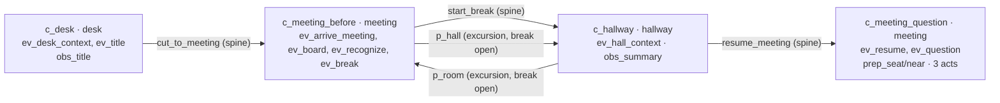

# The Correction — runtime handoff (headless first slice)

Branch `integration/vivi-v3-first-slice` · 2026-10-03 · **technical/headless evidence only.** No art, no final geometry, no browser player for this story, no product or human result. Nothing here is a Product PASS, and no row of the [acceptance matrix](V3_FIRST_SLICE_ACCEPTANCE.md) is marked passed by it: the matrix's independent QA (E) owns those results.

| Input | Pinned |
|---|---|
| Base (integration readiness) | `5d759448da890048be70416a33bbc724e7a1e630` |
| Foundation, merged complete | `ae60563c64ac245f94e7e1abc9a8a7089e844055` (merge commit on this branch) |
| Format Proof gold pack | `028e400fb78d888036a5e184a8060200e63a5a0b`; the three Correction spec files are byte-identical to it (SHA-256 pinned in the test) |
| Gold | `the-correction` · `gold-1` · source `correction-source-1` · source SHA-256 `b7be3674…5edce` · staging `editorial-staging-correction-1` |
| Contract | runtime manifest 3 · semantic schema 3 · post schema 3 · snapshot 1 |
| Adapter/compiler stand-in | `0.1.0-dev.1` |
| Geometry | `dev-placeholder-1` (development placeholder, not Design's) |

## Run it

```bash
npm run test:v3-correction          # 15 headless integration checks (also part of `npm test`)
npm run trace:v3-correction         # engineering trace, rich / correct_public
npm run trace:v3-correction -- --variant compressed --option pass_question
npm run trace:v3-correction -- --visits 3 --summary --title --position near --cancel --skip --json
```

## Files

| Path | Role | Public? |
|---|---|---|
| `src/data/experienceV3Fixtures/runtime/adaptGoldSpec.ts` | Generic gold planning envelope → `SemanticPlanV3`. Knows no story; every interpretation is input data; anything unmappable throws | yes |
| `…/runtime/compileFixturePlan.ts` | Generic deterministic compile `SemanticPlanV3` + geometry → `PlaybackManifestV3` (stand-in until A ships a compiler) | yes |
| `…/runtime/placeholderGeometry.ts` | Dev placeholder `GeometryExport` (all ids `dev_placeholder*`) | yes |
| `…/runtime/theCorrection.ts` | Correction adaptation data (rich + compressed), versions, manifest/post builders | yes; imports only `the-correction.semantic.json` |
| `…/runtime/theCorrection.presentation.ts` | Design slot table per scene and per act (public, pre-boundary) | yes |
| `…/runtime/theCorrection.reveal.ts` | `RevealRecordV3`, canaries, reveal presentation, host resolver | **private**; only reader of `reveal.private.json` |
| `…/runtime/theCorrection.provenance.ts` | Fact → gold → span trace from the pre-boundary ledger | engineering; reads `source.private.json`, never `revealSource` |
| `src/components/experience/v3/visualHooks.ts` | `VisualHooksV3` + `projectVisualHooks()` — the typed visual handshake | yes, generic |
| `scripts/lib/v3HeadlessHost.ts` | Generic headless host: performs every controller effect, fault injection, trace rows | dev |
| `scripts/lib/correctionWalk.ts` | Canonical Correction walks (only fixture-side code knows the story) | dev |
| `scripts/test-v3-correction.ts`, `scripts/trace-v3-correction.ts` | The tests; the dev trace CLI | dev |

The gold `spec/` directory is untouched. Nothing in `src/` outside `runtime/` imports the runtime fixtures, and the production build contains none of their text (checked against `dist/`).

## Gold spec → runtime mapping

`gold envelope ─adaptGoldSpec→ SemanticPlanV3 ─validateSemanticPlan→ compileFixturePlan→ PlaybackManifestV3 ─validateManifest / validateStoredPostV3 / loadPlayable(kind v3)`.

| Gold | Runtime | Notes |
|---|---|---|
| F01–F14 | `f01`–`f14`, claim text verbatim | Foundation ids are lowercase. Kinds: `relationship`/`context`→`observed` (per spec README), `belief`→`hero_belief`, `quote`→`quoted_speech`, `observed`, `timing` |
| Spans S01–S13 | `claims[].sourceSpanIds` `s01`… | The public module holds a span-id table; the test proves it equals the private ledger |
| Scenes c_desk, c_meeting_before, c_hallway, c_meeting_question | Same ids, same locations, purposes, required facts, observations, acts | Spine = gold spine |
| Soft-time events | Beats with the same ids, gold order and `after` | All `delivery: reader`; no timers. `ev_office_bed` (ambient) is presentation only, never a beat |
| `ev_desk_context` | `deliver [f01 f02 f04 f05 f13 f14]` | F04 is Mira's sentence from yesterday: narrated, **not** a live quote (gold §D) |
| `ev_title` | `deliver [f03]` | The readable checkpoint for the title; `obs_title` delivers the same receipt |
| `ev_arrive_meeting` | `transfer a_me → meeting [f05]` | Idempotent after the portal swap already moved the hero |
| `ev_board` / `ev_question` | `quote a_director f06` / `quote a_director f11` + `deliver [f12]` | The only live speech in the story |
| `ev_recognize`, `ev_hall_context` | `deliver [f07]`, `deliver [f09]` | |
| `ev_break` | `portal_state p_hall open` + `p_room open`, evidence `f08` | Delivers F08 |
| `ev_resume` | `portal_state p_hall closed` + `p_room closed`, evidence `f09` | Closes the break once |
| sceneTransitions | Spine portals `cut_to_meeting`, `start_break`, `resume_meeting`, labels verbatim | Open when the scene's reader beats are delivered (gold "exit state") |
| portals p_hall / p_room | Excursions `c_meeting_before ⇄ c_hallway`, labels "Step into the hallway again" / "Return to the room" | Labels are verbatim substrings of S09 |
| obs_title / obs_summary | Same ids, targets, labels, facts | |
| prep_seat / prep_near | `reposition own_seat` / `near_director` | |
| correct_public / request_private / pass_question | Same ids, verbs, targets, labels, motives, cost/feasibility facts | |
| d_the_correction_1 | Same id, scene, minimum knowledge (13 facts, not F10), options | `decisionVersion` `gold-1` |
| truthBoundary | `{ scene: c_meeting_question, after: primary_act }` | Stop frames → Design act slots (below) |
| Reveal R01–R03 | Separate `RevealRecordV3`, `authorOption: correct_public` | Never in any public structure |

**Result:** every runtime fact traces to an approved pre-boundary ledger entry and span. The test also checks the source hash, every span's code-point offsets, and that each quote is verbatim in its span. Every other visible string (labels, motives, tension, unknowns, accessible text, staging line) is gold envelope text or a verbatim substring of an approved span. A runtime fact with no ledger entry is reported as `missing`.

## Contract interpretations (reviewable decisions, all pinned by the test)

1. **Planning variable `break`** has no free-variable write in Foundation. It is carried by `portal_state` receipts on both doors (`portal_p_hall`/`portal_p_room` = open/closed), and its gates map to `state_is portal_p_hall`. A causal event's *first* cited fact is the evidence for its state change. So `ev_resume` (F09, F11) carries F09; F11 is delivered once, as the director's quote at `ev_question`.
2. **Doors name destination scenes.** A break room visit is `c_meeting_before` under the open break (gold §E: "not a fifth spine scene"). Its beats are all consumed, so nothing replays. Resume is available only from the hallway, as the gold transition specifies. A player in the room steps out again, then resumes. Whether to allow "Resume meeting" from the room view is an editorial question for C; no source transition supports it today.
3. **The gold lists `p_hall` as an exit of `c_meeting_question` "(break only)".** The break closes at `ev_resume` and Foundation doors are per scene, so no door is built from the question scene. Gold: "After Resume, portals to the prior break close."
4. **`decisionPhase = ready` gates are dropped.** Foundation derives readiness from the decision scene, every minimum receipt and the absence of an accepted act.
5. **Scene gates.** The `obs_title` scene gate is structural: Foundation offers an observation only in the scenes that list it. **Preparations are not scene-scoped in Foundation**, so prep_seat/prep_near are gated on `beat_delivered ev_resume`. That is S09: "When the meeting resumed, I could go back to my seat or stand nearer the director." Foundation gap noted for A.
6. **The title checkpoint.** If the player reads `obs_title` first, the desk still waits for the reader `ev_title` beat before "Go to the meeting". The beat adds no duplicate receipt. Design should present it as a continue/transcript beat, not a second reveal of the title.
7. `presentationMood: public` is required by `SemanticPlanV3` but absent from the gold, and is not carried into the manifest. Actor roles are slugged ids (`contract_worker`, …).
8. **Per-location hero marks.** Gold §F asks that re-entering the hallway restore the local hero mark. Foundation has no locomotion (`NavigationService` is not built), so the hero has one mark plus a `mark_role`. This is untestable until A ships locomotion. Pending A.
9. **A pending confirmation on resume** is cleared to "unaccepted" by Foundation. Reopening the sheet after resume is a shell choice; there is no state for it.

## Rich topology (gold-1, 4 views / 3 locations)



Arc indexes 0→1→2→3. Excursions never move the arc. While visiting the room, `start_break` is `not_next`; before the break opens, `p_hall` is `ahead_of_arc`. No door leads to the desk.

## Compressed control topology (gold §M, 2 frames / 1 location)

`c_compressed_before` (meeting, `memory`/`remembered`, `orient`: `ev_desk_context`, `ev_title`, `obs_title`) ─`cut_to_meeting` (same-location spine cut)→ `c_compressed_meeting` (meeting, `decide`: the same seven beats `ev_arrive_meeting … ev_question`, `obs_summary`, both preparations, three acts).

- Doors `p_hall`/`p_room` are removed (listed with reasons). The break is narrated, so `ev_break` delivers F08 and `ev_resume` delivers F09 as narration.
- `o_deck` is `offstage`: a recollected display, not invented in the meeting room.
- Revision and decision version are `gold-1-compressed`, so the control's first choices are a separate research cell. The control resolves the **same** reveal record.

**Parity (tested for all three acts):** identical received facts, delivered beat ids, opportunities (every field), decision id/minimum/options, truth boundary and author record. The only structural difference is the walkable break. The test makes no claim that either version is better.

## Persistence (A → B → A)

Tested over 5 and 25 hallway ⇄ room round trips:

- Received facts, seen observations, consumed events, delivered beats and door states are unchanged. Nothing is added.
- Rereading the summary adds no receipt. The board quote's event is consumed exactly once.
- Mira, the director, both displays and the summary never move, clone or reset. The summary stays `actor:a_me` in every scene.
- Only the hero transfers, and the arc stays at 2.
- Leaving the hallway before its delivery suspends it; it is still waiting on return and is delivered once.
- Readable availability in the hallway is identical before and after every trip.
- After resume, no prior-break door exists and the transcript survives.

## Truth boundary

At CONFIRM the snapshot is `boundaryLocked`. After that, only presentation, pause and reveal progress are accepted. Every world event is refused with the **same state object**: travel, observation, preparation (apply/undo), advance, selection, a second act, and cancel/undo. Entities at the end equal entities at acceptance (no NPC response, no transfer). `SKIP` reaches the same boundary and cannot create an act. The option-specific stop frames are Design/A presentation receipts (`ENACTED`/`HOLD_DONE`); the act slot table carries their gold text.

## Reveal separation

- The public manifest, post, semantic plan, adaptation trace, design slots, readable model (every step), visual hooks (every step), every saved snapshot and the dev trace contain none of 11 canaries. The canaries are the act, the why, the aftermath, and 8 distinctive phrases, so a partial copy is also caught. No public structure has an `act`/`why`/`aftermath`/`authorOption`/`choreography` key.
- The private file is unreachable from the public modules' import graph. Only `theCorrection.reveal.ts` and `theCorrection.provenance.ts` import private files, and nothing in `src/` outside `runtime/` imports either.
- The record is released only by the host's `load_reveal` after `BOUNDARY_DONE`, and resolves identically for both variants and all three acts.
- This separation is architectural, not secret: anyone can read the repository. A production host must serve the record from a trusted service.

## Readable path parity

A driver that uses only `buildReadableModel` and `readableEvents` completes both variants with all three acts. It uses no target, pointer, observation or movement. For every act it reaches exactly the required facts, an empty `missingKnowledge`, all three listed acts, and the same decision, account and reveal sequence (`BOUNDARY_DONE>reveal_loading`, `REVEAL_LOADED>revealed`, `END>ended`) as the spatial run. It is also checked statically: every required and minimum fact is delivered by a reader beat, never only by an observation, and every scene's required facts have accessible text. No readable model leaks reveal text.

## Story-level input contract

Through the real routing table (`routeKeydown`) and reducer:

- A world Enter opens the action list and never commits.
- The activation that opened the list cannot select, and the one that selected cannot confirm.
- While the confirmation is open, a world Enter or a held Enter is not the world's to act on.
- A confirmation for another act, or one sent after cancel, is `stale_confirmation`.
- Escape cancels to play and writes nothing.
- The director target opens a sheet, never a commit.
- During enactment Escape does nothing (no undo). After acceptance every world change is refused.

InputManager is unchanged.

## Placeholder geometry boundary

Every compiled scene uses `kitRevision`/`compositionRevision` `dev-placeholder-1` and `dev_placeholder_*` camera/light/audio recipes. Marks use the gold `heroPosition` vocabulary (`desk`, `own_seat`, `hall_threshold`, `near_director`) plus `deck_display`, `slide_display`, `threshold` and `door_jamb`. Mira and the director have staging marks: an allocation for the later meeting view, not evidence of earlier whereabouts. No controller, query, input or projection file mentions a placeholder (scanned). Swapping in a geometry export with other ids, revisions and hashes leaves every semantic field, `revision` and `decisionVersion` unchanged, and the manifest still validates.

## Exact Design replacement points

1. **Geometry:** `GEOMETRY` in `runtime/theCorrection.ts`. Replace `placeholderGeometry(...)` with Design's versioned office `GeometryExport` (`compileFixturePlan.ts` defines the shape): per scene `kitRevision`, `compositionRevision`, `cameraRecipe`, `lightRecipe`, `audioRecipe`, `entryMark`, `marks`; plus `actorMarks`, `assetRevisions` and real `assetHashes`. The required mark roles per scene come from `correctionSceneSlots()`, and the test fails if one is missing.
2. **Compositions:** the gold ids `c_desk_paper`, `c_meeting_before_paper`, `c_hallway_paper`, `c_meeting_question_paper` stay. The compressed control's `dev_placeholder_recollection_frame` and `dev_placeholder_meeting_frame` need Design ids, set in the `compressed` adaptation.
3. **Approved vocabularies:** pass Design's sets as `validateManifest(m, { vocab: { compositions, … } })`.
4. **Act captions:** `correctionActSlots()`. `pass_question` has the exact gold caption. `correct_public` and `request_private` are `pending_editorial`: the gold says the caption "names the intention without inventing a sentence", supplies no text, and code must not invent one. Owner: C with B.
5. **Poses/stop frames:** per act `physicalEnactment`, `finalPose` and `stopFrame` (gold text) are in the act slots, so Design implements them against `commitment.enactment` and sends `ENACTED`/`HOLD_DONE`/`SKIP`.
6. **Reveal page:** `CORRECTION_REVEAL_PRESENTATION` (private): the bridge line, the withheld note, and the sequence act (automatic) → why (reader) → aftermath (reader).
7. **Ambient:** `ev_office_bed` maps to the scene `audioRecipe`. It is presentation only, with no catch-up.

## Future visual integration points (`VisualHooksV3`)

Design subscribes to `projectVisualHooks(manifest, snapshot, settings)` and changes nothing except by dispatching ordinary controller events through the InputManager shell. It does not run a second state machine.

| Hook | Meaning | Correction use |
|---|---|---|
| `revisions` | experience/manifest/decision/attempt/locale/asset revisions | pin assets; drop stale async results |
| `phase` | loading … ended | layer lifecycle, enactment, author page |
| `scene` (+ compiled recipe ids, marks) | current scene/location/purpose/composition | mount desk / meeting / hallway layers |
| `transition` | `preloading` (source still mounted, tx id, from/to) / `entering` / `idle` | threshold, cut and match recipes; preload is side-effect free |
| `actors[]` | owner, location, `inView`, `visibleThrough`, mark, `markRole` | Mira/director are seen through the open door from the hallway (`visibleThrough: p_room`) and never transferred |
| `objects[]` | owner, `heldBy`, `inView` | summary `heldBy a_me` in every scene; deck at desk, slide in meeting |
| `knowledge` | received facts, delivered beats, `readerCanAdvance` | captions and transcript; no replay |
| `attention` | selected target, open observation (facts, presentation) | title and summary inserts as DOM text |
| `doors[]` | label, availability, open/closed state | break overlay = door state `open` |
| `opportunity` | selected act, pending confirmation | graphite selection / pending mark |
| `commitment` | decision, option, status, `enacting`/`holding`/`done` | per-act pose to the stop frame |
| `boundary` | `locked`, `reached` | held trace |
| `reveal.phase` | `idle`/`loading`/`failed`/`ready` | author page entry and retry; text comes via the host, never via hooks |
| `presentationEligible`, `pauses` | hidden/blur/user pause | stop sampling, no catch-up |
| `settings` | reduced motion, high contrast, audio (`unavailable` today) | stills and cuts; mute; changes nothing else (tested) |

Still to build in the visual pass:

- The `ExperiencePlayerV3` shell that mounts this through `loadPlayable(...).kind === 'v3'`. App.tsx is untouched here, and the Foundation placeholder shell plus harness remain.
- An audio path.
- A browser-level Correction run (the Foundation browser suite covers the generic input/focus paths only).

## Foundation changes (behavior only; no schema or contract type changed)

Each fix is minimal and generic. Each is proven by a Correction-level test that fails without it, verified by reverting each fix in turn. Foundation's own 31 + 16 checks still pass. A should review them.

| # | Bug | Fix |
|---|---|---|
| 1 | **Overlapping repositions** (`ExperienceController.applyPreparation`). prep_near then prep_seat left both active; undoing prep_near wiped the hero's mark while prep_seat still read "applied". This is the exact gold seat ⇄ near pair | A new reposition supersedes the active one and inherits its baseline undo |
| 2 | **Leak detector false negatives** (`validate.findPrivateLeaks`). A canary containing `"`, `\` or a newline was compared unescaped against a JSON-escaped haystack, so it was never found | Compare the needle in its serialized form |
| 3 | **Resume swallowed fresh input** (`restoreSnapshot`). Restored snapshots kept the previous page session's consumed activation ids, while a reloaded InputManager restarts at `k1`/`p1`. The first up-to-32 gestures after a reload were rejected as `duplicate_activation` | Clear per-session activation ids on restore. Nothing an old activation could double-act on survives restore (sheet, reservation and observation are already cleared) |
| 4 | **Tampered or malformed snapshots accepted** (`restoreSnapshot`). Non-list `preparations` or null `variables` made the reducer throw later; a missing clock produced null time; actors carried by actors, entities in unknown places, a hero away from the snapshot location, unknown beats/observations and a foreign decision id were all accepted | Validate the shape of everything the reducer later reads, owner validity, hero location and decision identity |

## Acceptance-matrix rows with headless evidence (not PASS; E owns results)

Pure-reducer evidence now exists for:

- the controller/topology parts of **T02, T08–T13, T15–T17**;
- the reducer-side **T18–T21** (no NPC change; one acceptance; the boundary is locked; skip reaches the same receipt);
- **T22** (payload/canary/trace);
- **T23/T24** (separate record, same account, failure retains the act, atomic swap);
- **T26** (the readable path, at the model level).

Every row still needs E's browser, device, AT, audio and visual evidence. Product rows P01–P12 are untouched.

## What this cannot prove

Atmosphere, emotional engagement, whether the hallway adds understanding or care (P06/P07: product pending, and the hallway is retained only if human comparison shows a gain), visual quality, reveal impact, user understanding, EN/RU parity (English only; the Russian gold is pending), device/AT behavior and performance.

## Remaining Design (and editorial) dependencies

1. A versioned office `GeometryExport` for desk / meeting / hallway, with the mark roles above and real asset hashes.
2. Composition and recipe vocabularies, including the two compressed-control frames.
3. Per-act poses to the gold stop frames, the held trace and the reduced-motion stills.
4. Caption copy for `correct_public` and `request_private` (C with B).
5. A hallway threshold composition that shows the room through the open door, driven by `visibleThrough`.
6. The author-page reveal layout using the private presentation record.
7. Product-owner approval of the Remembered Room visual direction (still provisional).

## Verdict

**READY FOR VISUAL INTEGRATION.**

The Correction runs headlessly through the complete Foundation, with stable hooks, a replaceable placeholder geometry, and the Design slots named. Preconditions for that pass:

- A reviews the four Foundation fixes above.
- Design supplies the geometry/vocabulary in the shape above.
- The caption copy for two acts is authored editorially, not in code.
